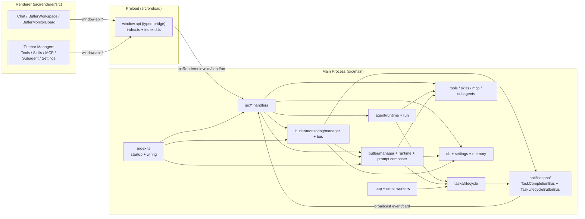
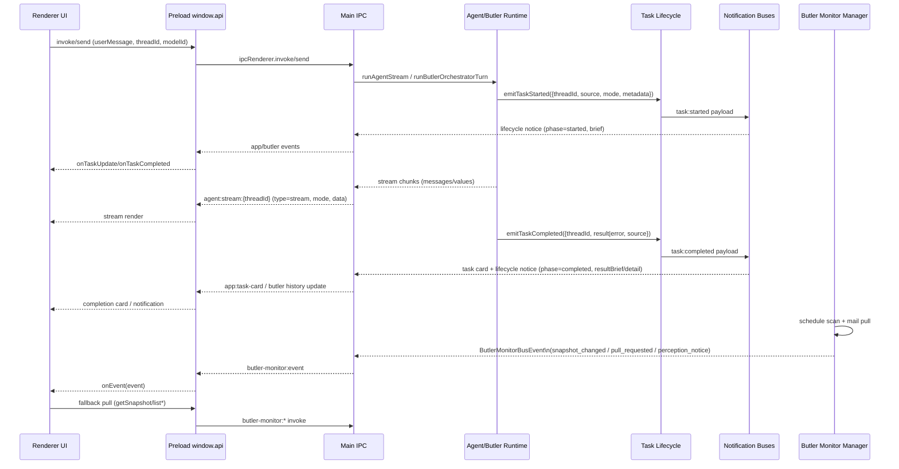

# OpenAnyWork 架构说明

本文档描述当前仓库的整体架构，并覆盖最近一次重构（Butler 总线、能力双开关、Prompt 组合器）。

## 1. 架构目标

- 让 Agent 在桌面端可控地执行复杂任务（文件、命令、工具、MCP、子智能体、技能）。
- 将主进程编排能力（运行时、任务总线、Butler、监控）与渲染层 UI/交互解耦。
- 在不破坏历史配置的前提下，支持能力按场景分域启用（Classic / Butler）。
- 将 Butler 提示词从“手写拼接”升级为“可插拔 section pipeline”，降低后续扩展成本。

## 2. 进程分层

- `src/main`：Electron 主进程，负责业务内核、调度、持久化、IPC 注册。
- `src/preload`：安全桥接层，把 `ipcRenderer` 能力封装为 `window.api`。
- `src/renderer`：React UI，负责会话、管理面板、Butler 工作区、监控看板。

## 3. 目录与模块职责

### 3.1 主进程（`src/main`）

- `index.ts`：应用启动入口，初始化 DB、内存服务、Butler、监控管理器、总线与 IPC。
- `agent/`：普通对话 Agent 运行时与流式执行。
- `butler/`：Butler 编排器、任务管理器、感知提醒、提示词体系。
- `tasks/`：任务生命周期事件源（started / completed）。
- `notifications/`：任务通知总线（桌面卡片、Butler 生命周期桥接）。
- `ipc/`：所有主进程 IPC handler（agent/tools/skills/mcp/subagents/settings/...）。
- `tools/`、`skills/`、`mcp/`、`subagents.ts`：能力注册、配置读写、运行时注入。
- `loop/`、`email/`：自动化任务执行器（周期触发、邮件触发）。
- `db/`：SQLite schema 与迁移。
- `memory/`：会话摘要、日画像、Butler 历史与任务落盘。

### 3.2 预加载层（`src/preload`）

- `index.ts`：导出 `window.api`，将 IPC 调用包装成强类型 API。
- `index.d.ts`：Renderer 全局类型声明，约束 `window.api` 接口面。

### 3.3 渲染层（`src/renderer/src`）

- `components/titlebar/*Manager.tsx`：Tools / Skills / MCP / Subagent / Settings 管理面板。
- `components/butler/ButlerWorkspace.tsx`：Butler 主工作区。
- `components/butler/ButlerMonitorBoard.tsx`：监听任务面板（主动拉取 + 被动订阅）。
- `lib/i18n.ts`：多语言文案。
- `types.ts`：前端与 preload 对齐的共享类型。

### 3.4 模块分布图



## 4. 核心执行链路

### 4.1 经典对话链路（Classic）

1. Renderer 调用 `window.api.agent.invoke/streamAgent`。
2. 主进程 `ipc/agent.ts` 读取线程元数据并执行 `runAgentStream`。
3. `agent/run.ts` 调用 `createAgentRuntime`，流式回传消息到 Renderer。
4. 生命周期通过 `emitTaskStarted/emitTaskCompleted` 发事件，通知层消费。

### 4.2 Butler 任务编排链路

1. Renderer 调用 `window.api.butler.send`。
2. `butler/manager.ts` 组装上下文，调用 `runButlerOrchestratorTurn`。
3. Orchestrator 产出一个或多个 dispatch intent。
4. Manager 创建任务线程并入队，`task-dispatcher.ts` 执行任务。
5. 任务状态变化通过生命周期总线回流到 Butler 通知流与 UI。

### 4.3 关键通信时序图（含主要交流内容）



## 5. 数据与持久化

### 5.1 SQLite

- `tool_config`：工具密钥与开关。
- `mcp_servers`：MCP 服务定义、运行配置与开关。
- `subagents`：子智能体定义与开关。
- 迁移后新增列：
  - `enabled_classic`
  - `enabled_butler`
- 兼容策略：
  - 历史 `enabled` 通过 `COALESCE` 同步复制到两侧开关。

### 5.2 配置文件

- `skills.json`：技能启用状态（兼容旧 `enabled`，新结构支持双开关）。
- `app_settings`（DB 表）：
  - Butler 设置新增 `monitorScanIntervalSec`、`monitorPullIntervalSec`。

## 6. 能力双开关模型（Classic / Butler）

### 6.1 类型层

以下结构增加了双开关字段，并保留 `enabled` 兼容字段：

- `ToolInfo`
- `SkillItem`
- `McpServerConfig`
- `SubagentConfig`
- `CapabilityScope = "classic" | "butler"`

### 6.2 运行时注入规则

- `createAgentRuntime` 新增 `capabilityScope`，默认 `classic`。
- 注入工具/MCP/技能/子智能体时按 scope 过滤。

scope 来源约定：

- 手动对话（`ipc/agent.ts`）固定 `classic`。
- Butler 派发任务（`butler/task-dispatcher.ts`）固定 `butler`。
- Loop / Email 线程按 metadata：
  - `createdBy === "butler"` -> `butler`
  - 否则 -> `classic`

### 6.3 IPC 与兼容行为

- 新增 scope 级开关接口：
  - `tools:setEnabledScope`
  - `skills:setEnabledScope`
- 旧接口仍保留：
  - `tools:setEnabled`
  - `skills:setEnabled`
- 旧接口语义：同步写两侧开关（兼容历史调用方）。

## 7. 总线机制（本次重构重点）

### 7.1 任务生命周期总线（开启/完成）

事件源：

- `tasks/lifecycle.ts`
  - `emitTaskStarted`
  - `emitTaskCompleted`
  - `onTaskStarted`
  - `onTaskCompleted`

Butler 桥接：

- `notifications/task-lifecycle-butler-bus.ts`
  - 订阅 started/completed。
  - 生成 `TaskLifecycleNotice`。
  - 基于事件 ID 去重，避免重复通知。

启动挂载：

- `index.ts` 初始化 `TaskLifecycleButlerBus`，将 notice 注入 `butlerManager.notifyLifecycleNotice(...)`。
- `TaskCompletionBus` 继续用于卡片/桌面提示；对 Butler 的完成通知改为 no-op，避免重复路径。

### 7.2 Butler 监听总线（主动拉取 + 被动通知）

事件总线：

- `butler/monitoring/bus.ts` 定义并广播 `ButlerMonitorBusEvent`：
  - `snapshot_changed`
  - `pull_requested`
  - `perception_notice`

管理器：

- `butler/monitoring/manager.ts`
  - 定时扫描时间事件（calendar/countdown）。
  - 定时拉取邮件（interval/manual/startup/rule_update）。
  - 生成 perception notice 后立即上报总线。
  - 变更后立即发 `snapshot_changed`。

设置驱动：

- `settings.butler.monitorScanIntervalSec`（默认 30 秒）
- `settings.butler.monitorPullIntervalSec`（默认 60 秒）
- `ipc/settings.ts` 更新设置后调用 monitor manager `refreshIntervals()` 重载计时器。

前端消费：

- 被动：`ButlerMonitorBoard.tsx` 订阅 `window.api.butlerMonitor.onEvent(...)`。
- 主动：看板内置周期 `getSnapshot/list*` 拉取兜底，保证在失订阅或窗口切换场景可恢复同步。

## 8. Butler Prompt 组合器（本次重构重点）

### 8.1 设计

- 新增 `butler/prompt/composer.ts`，定义 section builder 接口与 pipeline。
- 当前固定顺序：
  - `overview`
  - `memory`
  - `router`
  - `capabilities`
- 每个 section 独立文件：
  - `butler/prompt/sections/overview.ts`
  - `butler/prompt/sections/memory.ts`
  - `butler/prompt/sections/router.ts`
  - `butler/prompt/sections/capabilities.ts`

### 8.2 兼容与回归保护

- `butler/prompt.ts` 仍保留兼容导出 `buildButlerUserPrompt(...)`，内部改调 composer。
- `butler/runtime.ts` 直接调用 composer 生成 user prompt。
- 关键 marker 继续保留并受回归保护：
  - `[Daily Profile]`
  - `[Profile Delta]`
  - `[Capability Summary]`

### 8.3 扩展方式

新增 section 时仅需：

1. 新建 `sections/<name>.ts`。
2. 在 `DEFAULT_SECTION_PIPELINE` 注册顺序。
3. 无需改 runtime 主流程。

## 9. 前端管理面板改造（本次重构重点）

- `ToolsManager`：每个工具展示并切换 `Classic / Butler` 两个开关。
- `SkillsManager`：每个技能展示并切换 `Classic / Butler` 两个开关。
- `McpManager`：列表页与编辑页支持双开关。
- `SubagentManager`：列表页与编辑页支持双开关，选择器状态提示按双开关语义显示。
- `SettingsMenu`：新增 Butler 监听扫描/拉取间隔设置项。
- `i18n`：新增 scope 与 monitor 设置文案。

## 10. 关键 IPC 面

### 10.1 能力管理

- `tools:list/setKey/setEnabled/setEnabledScope`
- `skills:list/create/install/delete/setEnabled/setEnabledScope/getContent/saveContent`
- `mcp:list/tools/create/update/delete/start/stop`
- `subagents:list/create/update/delete`

### 10.2 监听任务

- 请求/拉取：
  - `butler-monitor:getSnapshot`
  - `butler-monitor:calendar:*`
  - `butler-monitor:countdown:*`
  - `butler-monitor:mail:*`
- 被动推送事件通道：
  - main -> renderer: `butler-monitor:event`

### 10.3 重要通信方式与交流内容

| 通信方式 | 方向 | 通道/接口 | 交流内容（关键字段） |
| --- | --- | --- | --- |
| IPC 请求（同步结果） | Renderer -> Main | `window.api.* -> ipcRenderer.invoke` | 功能请求参数，例如 `threadId`、`message`、`updates`、`scope`、`id` |
| IPC 流式事件 | Main -> Renderer | `agent:stream:{threadId}` | `type`（`stream/done/error`）、`mode`（`messages/values`）、`data`（模型输出块） |
| 生命周期内部总线 | Main internal | `task:started` / `task:completed` | `threadId`、`mode`、`source`、`startedAt/finishedAt`、`result/error`、`metadata` |
| 生命周期到 Butler 桥接 | Main internal | `TaskLifecycleButlerBus` | `TaskLifecycleNotice`：`phase`、`title`、`mode`、`source`、`resultBrief/resultDetail` |
| 完成通知卡片 | Main -> Renderer | `app:task-card` | `TaskCompletionNotice`：`title`、`resultBrief`、`threadId`、`mode`、`noticeType/eventKind` |
| Butler 监控被动推送 | Main -> Renderer | `butler-monitor:event` | `ButlerMonitorBusEvent`：`snapshot_changed`（全量快照）、`pull_requested`（拉取来源）、`perception_notice`（提醒卡片） |
| Butler 监控主动拉取 | Renderer -> Main | `butler-monitor:getSnapshot` / `calendar:*` / `countdown:*` / `mail:*` | 看板同步数据（事件、计时器、邮件规则、最近邮件） |
| 配置更新触发重载 | Renderer -> Main | `settings:update` | `updates.butler.monitorScanIntervalSec`、`updates.butler.monitorPullIntervalSec`，并触发监控定时器重载 |
| 双开关能力配置 | Renderer -> Main | `tools:setEnabledScope` / `skills:setEnabledScope` / `mcp:update` / `subagents:update` | `scope`（`classic/butler`）与对应启用状态；旧接口兼容同步双侧 |

## 11. 扩展建议

- 新增能力类型（例如 Plugin）时，优先复用 `CapabilityScope` 语义与双开关迁移策略。
- 新增 Butler 提示词段落时，保持 section 单一职责，避免在 runtime 拼接业务逻辑。
- 新增任务来源时，务必在启动点补 `emitTaskStarted`，并保证异常路径能落 `emitTaskCompleted`。
- 前端新面板若需要实时性，优先接入被动事件，再加低频主动拉取兜底。

## 12. 验证基线

建议最小回归命令：

```bash
npm run typecheck
npm run build
```

重点人工场景：

- 双开关矩阵验证：`classic=false,butler=true` 与反向配置是否按线程来源生效。
- 生命周期通知：agent/loop/email/butler 是否都有 started + completed。
- Butler 监控：关闭主动刷新后是否可被动更新；关闭订阅后是否可在周期拉取恢复。
- Prompt 组合：section 顺序是否稳定，新增 section 是否无需修改 runtime 主逻辑。
