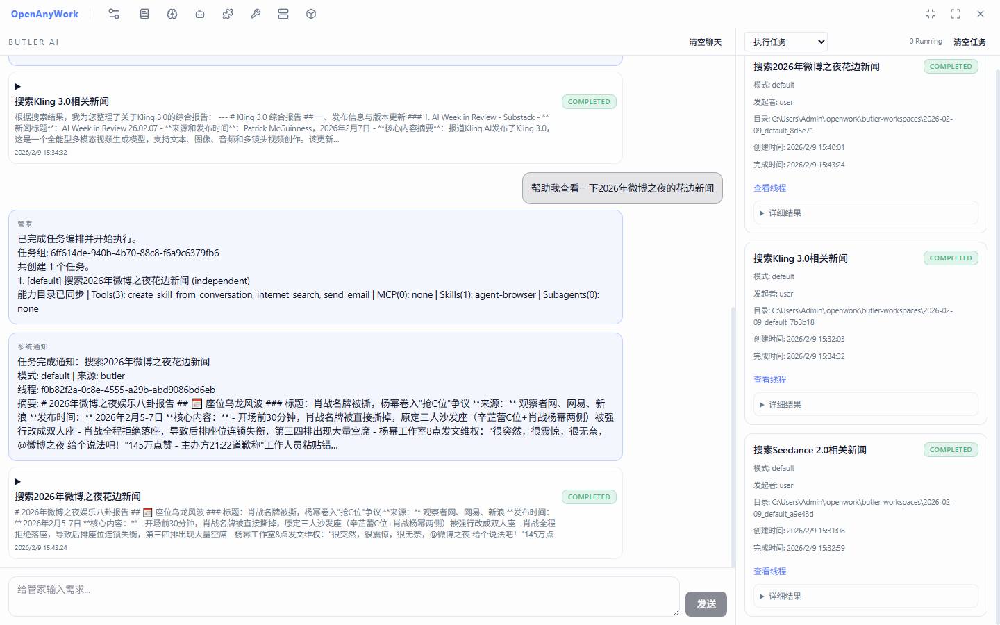

# OpenAnyWork Deep Agent Workbench

[![npm][npm-badge]][npm-url] [![License: MIT][license-badge]][license-url] [](README.md) [](README.zh-CN.md)

[npm-badge]: https://img.shields.io/npm/v/openwork.svg
[npm-url]: https://www.npmjs.com/package/openwork
[license-badge]: https://img.shields.io/badge/License-MIT-yellow.svg
[license-url]: https://opensource.org/licenses/MIT

OpenAnyWork 是一个面向 Deep Agent 的桌面工作台：不只是聊天，而是让 Agent 在本地工作区里调用工具、执行任务、持续编排。

> [!CAUTION]
> OpenAnyWork 会让 AI 读写本地文件并执行命令。请只在可信工作区运行，非隔离模式下务必审查执行行为。




## 快速开始

### 环境要求

- Node.js `>=18`
- npm
- Docker（可选，但建议开启隔离执行）

### 本地开发

```bash
git clone https://github.com/Antony-Jia/OpenAnyWork
cd OpenAnyWork
npm install
npm run dev
```

### 构建

```bash
npm run build
```

## 功能总览

- 双工作模式：`Classic`（线程工作流）与 `Butler`（编排工作流）。
- 独立窗口能力：Quick Input（全局快捷键 `Ctrl+Alt+Space`）与任务桌面弹窗。
- 支持线程类型：`default / ralph / email / loop / expert / butler`。

## Classic 页面功能

### 线程侧栏

- 新建不同模式线程（default/ralph/email/loop/expert）。
- 支持线程重命名、删除，并可选择"同时删除线程记忆摘要"。
- 支持按来源筛选线程（全部 / 人工 / 管家）。

### 中央标签区

- 固定 `Agent` 会话页 + 文件标签页并行浏览。
- 文件查看支持代码、文本、图片、PDF、媒体、二进制文件。

### 聊天区

- Agent 流式对话与工具调用过程展示（含 tool call / result）。
- HITL 审批、中断与取消（受线程能力配置约束）。
- 支持语音输入（STT）与语音播报（TTS）。
- 支持图片与文档附件（文档会解析提取文本后注入消息）。

### 右侧面板

- 任务 Todo 状态面板。
- 工作区文件树（关联目录、自动刷新、文件打开）。
- Subagent 运行状态列表。
- Docker 挂载文件视图。
- Ralph 进度视图（Ralph 模式）。

## Butler 页面功能

### 主会话编排

- Butler 每轮在"直接回复 / 澄清 / 创建任务"间做语义决策。
- Butler 支持"直接工具操作 / 创建任务"双路径：日常操作优先直接工具，不必启动任务。
- 支持单轮多任务创建、依赖关系（`dependsOn`）与并发调度。
- 支持任务 handoff（`context / filesystem / both`）。

### Butler 日常工具函数

- `calendar_upsert`：统一新增/修改日历事件（`action=create|update`）。
- `countdown_upsert`：统一新增/修改倒计时（`action=create|update`）。
- `query_calendar_events`：按时间窗口查询日历事件（支持语义时间转绝对时间后调用）。
- `query_countdown_timers`：按状态与时间窗口查询倒计时。
- `pull_rss_updates` + `query_rss_items`：主动拉取 RSS 并查询摘要/详细内容。
- `query_mailbox`：主动读取今天邮件或最近 N 封邮件（默认最近 10 封）。
- Butler 模式下硬限制禁止系统命令与文件系统工具调用（仅对话/业务工具/任务创建）。

### 任务看板

- 展示任务状态（queued/running/completed/failed/cancelled）。
- 支持从看板直接打开任务线程。
- 支持清空 Butler 历史和任务记录。

### 监听看板（Butler Monitor）

- 日历事件提醒。
- 倒计时提醒。
- 邮件规则拉取（IMAP）。
- RSS 订阅增量拉取。
- 支持手动立即拉取（`pullNow`）。

### 汇总通知

- 事件通知卡片与摘要卡片（digest）回流 Butler。
- 支持任务静默（mute）与摘要周期配置。

## 标题栏管理中心（页面入口）

- `Settings`：语言/主题、Provider、Ralph、Email、Speech、Butler 配置等。
- `Subagents`：子智能体配置（模型、工具、中间件、技能、作用域开关）。
- `Tools`：工具密钥与启用状态（Classic/Butler 双作用域）。
- `Skills`：扫描、创建、安装、编辑、启停（Classic/Butler 双作用域）。
- `MCP`：Server 配置、启动/停止、工具发现、作用域开关。
- `Prompts`：模板新建/搜索/查看/编辑/删除/复制。
- `Plugins`：预置插件管理（当前内置 Actionbook）。
- `Container`：Docker 配置与会话控制。
- `Memory`：Conversation Memory 与 Butler Global Memory 管理。

## IPC 核心能力（模块级）

主进程 IPC 模块覆盖：

- Agent
- Threads
- Workspace
- Loop
- Expert
- Butler
- Butler Monitor
- Prompts
- Memory
- Models & Provider
- Tools
- Skills
- Subagents
- MCP
- Docker
- Settings
- Speech
- Notifications
- Plugins

主进程广播事件包括（非完整列表）：

- `threads:changed`
- `thread:history-updated`
- `app:toast`
- `app:task-card`
- `butler:state-changed`
- `butler:tasks-changed`
- `butler-monitor:event`

## 通知与独立窗口能力

- 系统托盘驻留、主窗口隐藏与恢复。
- 任务桌面弹窗（支持打开线程、关闭、静默任务）。
- Quick Input 独立窗口（`Ctrl+Alt+Space` 呼出，直接发给 Butler）。

## 能力边界与实现细节

- 发送消息前需先为线程绑定 workspace。
- Loop 在应用重启后默认重置为暂停，不自动恢复。
- Prompt 模板是素材库，不会自动注入每轮消息。
- Docker 管理入口当前按实现限制为 Windows 可用。
- 右侧文件区的 `Sync to Disk` 按钮当前为占位行为，不代表已实现双向同步。

## 记忆系统（Memory）

### 自动记忆写入

- 任务完成后自动抽取会话摘要（模式、简述、详情、工具过程、偏好标签等）。
- Butler 主会话（`butlerMain`）不写入对话记忆摘要。

### 日画像（Daily Profile）

- 启动时基于"昨天"的任务摘要聚合生成日画像与对比文本。
- Butler 编排提示词引用 `[Daily Profile]` 与 `[Profile Delta]`。

### 管理入口

- 标题栏 `Memory` 查看 Conversation Memory（按线程分组）与 Butler Global Memory。
- 支持一键清空全部记忆。

## 本地数据目录

所有本地数据默认位于 `~/.openwork/`：

- `openwork.sqlite`：主数据库（线程、prompt 模板、MCP、工具、子智能体、设置等）
- `memory.sqlite`：记忆数据库（任务摘要、日画像、Butler 历史消息/任务）
- `langgraph.sqlite`：通用检查点数据库
- `threads/*.sqlite`：线程级检查点
- `threads/*.ralph.jsonl`：Ralph 日志
- `butler-workspaces/`：Butler 任务工作目录（默认，可在设置中修改）

## 相关文档

- 架构说明：[`ARCHITECTURE.md`](ARCHITECTURE.md)
- 邮件模式：[`EMAIL.md`](EMAIL.md)
- 语音接口：[`SPEECH_API.md`](SPEECH_API.md)
- 贡献指南：[`CONTRIBUTING.md`](CONTRIBUTING.md)

## 许可证

[MIT](LICENSE) © LangChain
